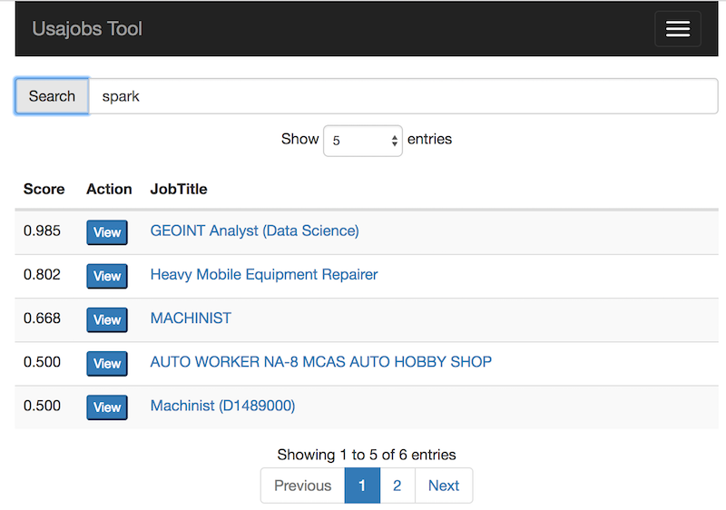
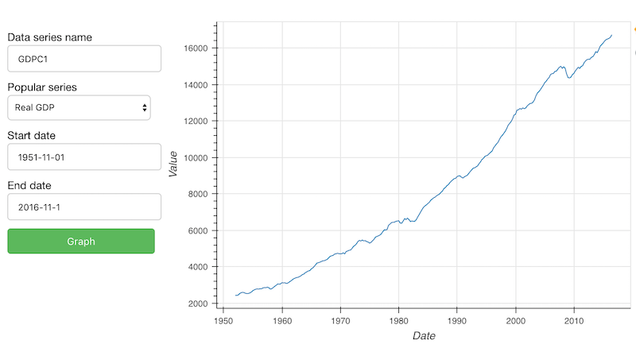

# Projects

Here are a few projects from my [github page](https://github.com/mgalbright):

## Usajobs Search Tool

Have you ever looked for US government jobs on [usajobs.gov](https://www.usajobs.gov)?  If you have, you may have noticed that some search results are not that relevant--for example, searching for _mathematician_ often returns jobs like _waiter_ or _bartender_ (who need _math_ skills).  Similarly, searches for _spark_ (the data science tool) often returns _auto mechanics_ (who change spark plugs).  

To improve user experience, I made a web app to search usajobs.gov and 
customize search results based upon user interest.  
The app is cross platform and mobile friendly, and it uses customizeable 
machine learning to learn your preferences and show you the most interesting 
jobs first.
You can check out the git repository [here](https://github.com/mgalbright/usajobtool).   

You can try try the app online [here](https://developer.usajobs.gov/).  
(Note: it's hosted on a free heroku account, so the page could be sluggish.)

<!---->
<!--Can customize the width using inline html-->
<a href="https://github.com/mgalbright/usajobtool"><a>

## Bokeh Examples

I have made a few easily-modified Bokeh examples which are useful 
for quickly building and deploying interactive Bokeh websites in python. 
Check out the git repo [here](https://github.com/mgalbright/Bokeh-examples).

<!---->
 
